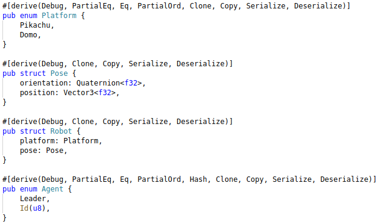
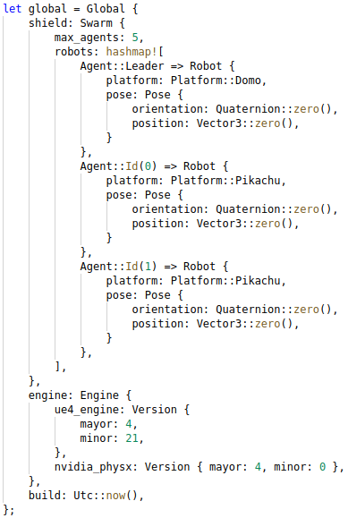
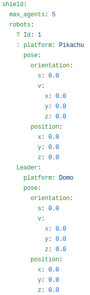
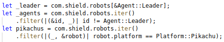

# Algebraic data type domain encoding
A reference implementation.

### Encode problem domain using product and sum types, with annotations for auto-serialization.

### Construct types that represent valid states, making invalid states unrepresentable.

### Save or load from/to config files. As domain has been encoded using algebraic data types, load/save will preserve integrity of state or fail to produce invalid state.

### In source code, all queries and filters would be strongly-typed and numerous branching logic would fail if new cases are not handled, or types have been refactored.

